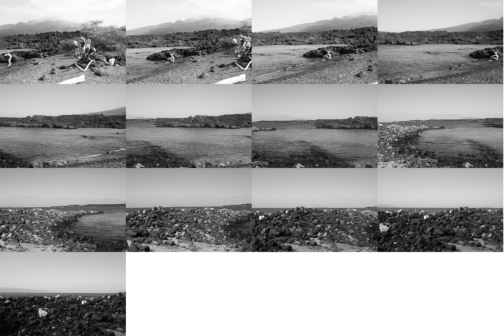

# Panorama Generator in MATLAB
A MATLAB script to generate panoramic images, using SIFT &amp; RANSAC. Also includes experiments with raw-pixel based descriptors.

# 1. Preparing Data
The images that will be stitched together are given below:


<br>
<p align="center"><i>Figure 1: Fishbowl image set</i></p>


<br>
<p align="center"><i>Figure 2: Golden Gate image set</i></p>

# 2. Detecting and Describing Local Features

# a) Key Points (Interest Points)

The following images show all drawn key points in the first images of both
image sets. Some of the key points were too small, so they were not shown by
MATLAB.

<br>
<p align="center"><i>Figure 3: Key Points for the 0th image of fishbowl image set</i></p>


<br>
<p align="center"><i>Figure 4: Key Points for the 0th image of golden gate image set</i></p>

# b) Descriptors

# i. SIFT Descriptor (Gradient Based)

The following images show 200 randomly selected SIFT descriptors from
the first images of Golden Gate and Fishbowl image sets. The reason for displaying
200 random descriptors is that descriptors are large squares, therefore it is difficult to
display all of them at once.


<br>
<p align="center"><i>Figure 5: Random 200 SIFT Descriptors for the 0th image in fishbowl image set</i></p>


<br>
<p align="center"><i>Figure 6: Random 200 SIFT Descriptors for the 0th image in fishbowl image set</i></p>

# ii. Raw-Pixel Based Descriptor

Raw-pixel based descriptor was implemented as follows.


Consider a keypoint k 1 in I 1

Form a square binary mask,located at k 1 ,
where the distance between sides and k 1 is the scale of the keypoint.


Rotate this square counter−clockwise,amount of orientation of k 1
Compute the histogram of I with respect to the mask
Below images show example rotated square window for some key point:


<br>
<p align="center"><i>Figure 7 : Example key point selected from one of the images. Scale is magnified, the angle was
calculated to be apx. -168 degrees</i></p>


<br>
<p align="center"><i>Figure 8 : The rotated square window of the key point in Figure 7. The windows were rotated
successfully, as the small angle it is making with horizontal axis is apx. 12 degrees.</i></p>

Below are randomly selected 5 histograms from the selected key points
shown below.


<br>
<p align="center"><i>Figure 9 : Randomly selected 5 key points, whose descriptors were plotted in Figure 10.</i></p>


<br>
<p align="center"><i>Figure 10 : Raw pixel based descriptors of the key points shown in Figure 9.</i></p>

# 3. Feature Matching

For the feature matching, Best-Bin-First Search algorithm, developed by
David Lowe, was used, which is explained below [1]. For computing the distance,
Euclidean distance was used.

The images below show an example of the features matched from the first
two images of both image sets. For this step, finding a matching keypoint k 2 for a key
point k 1 was done by finding the key point k 2 that is:

- closest to k 1 (nearest neighbour (nn) of k 1 in the second image)
- its distance between k 1 is smaller than a threshold T, where T is defined by:
- T := (The distance between k 1 and its second-nearest neighbour) X (Threshold ratio R) <br>

Instead of finding a constant optimal distance T, the T distance was tuned
dynamically, with respect to the second-nearest neighbour, as the distance between
key points may vary in different images. The similarity ratio was tuned as `R = 2 / 3`.<br>

Hence, feature matching can be described with the following algorithm:
```
I_1 := The first image
I_2 := The second image
for a keypoint k_1 in I_1:
    nn_dist= min(∀k_2 ∈ I_2) { eucl_dist(k_1 ,k_2 ) }
    nn = {k_2 | eucl_dist(k 1 ,k 2 ) = nn_dist , ∃k_2 ∈ I_2 }
    second_nn_dist = min (∀k_2 ∈ I_2 - {nn}) { eucl_dist(k_1, k_2) }
    second_nn = {k_2 | eucl_dist(k_1 ,k_2) = second_nn_dist, ∃k_2 ∈I_2 − {nn} }
    T = second_nn_dist ∗ R
    if nn_dist < T and second_nn exists:
        k_1 matches with nn
```

# a) Using SIFT Descriptors


<br>
<p align="center"><i>Figure 11: Golden Gate - matched features between 0th (right) image and 1st (left) using SIFT
descriptors</i></p>


<br>
<p align="center"><i>Figure 12: Fishbowl - matched features between 0th (right) image and 1st (left) using SIFT descriptors</i></p>

# b) Using Raw-Pixel Based Descriptors

Below are the matched features for 0th and 1st images of two image sets. It
should be noted that, with the raw-pixel based descriptors, we have even less number
of matched points.


<br>
<p align="center"><i>Figure 13: Fishbowl - matched features between 0th (right) image and 1st (left) using Raw-pixel based descriptors</i></p>


<br>
<p align="center"><i>Figure 14: Golden Gate - matched features between 0th (right) image and 1st (left) using Raw-pixel based descriptors</i></p>

There are several reasons for this but the fact that the histogram has no
direct information about the orientation of the interest point, and the fact that
histogram of a window is not rotation invariant are the main reasons.

# 4. Image Registration

The source [2], which explains image stitching using projective
transformations and SURF descriptors, were helpful in the implementation of this step.


# a) RANSAC Parameter Tuning

For RANSAC algorithm, estimateGeometricTransformation2D()
method was used to estimate an affine transformation between two pairs, whose
features were matched [3]. The parameters were tuned as following:

`MaxNumTrials = 50 000` : This parameter was set as high as possible
to give freedom for tuning other parameters. However, it should not be
too large, like 1 million, so that computation of each panorama does
not take more than 1 minute.<br>
`Confidence = 99.99`: Increasing this parameter along with
MaxDistance was helpful overall. In fact, increasing the confidence
interval will lead in more tight bounds for the expected transformations
matrices.<br>
`MaxDistance = 0.1`: This parameter had default value of 1.5.
However, with the default values, the estimated transformations had
mismatches, even for objects that were very far away, in which affine
transformations perform well. Therefore, more features needed to be
marked as outliers, so that RANSAC finds a transformation that will
result in a rotation, shear, and scaling, instead of straight translations.
<br><br>
While the raw-pixel based descriptor was used, those parameters were
tuned such that if estimation fails, the parameters were flexed exponentially:


```
elseif (descriptor_choice == "raw")
  conf=80;
  max_dist=2.5;
  max_num_trials=1000000;
  status = -1;
  while status ~= 0
    [transform(i), ~, status] = estimateGeometricTransform2D(...
                                transpose(match_locations), transpose(match_locations_prev), ...
                                'affine', MaxNumTrials=max_num_trials, ...
                                Confidence=conf, MaxDistance=max_dist);
    if (status ~= 0)
      warning("Could not find enough inliers, now re-adjusting " ...
               + " parameters to find enough inliers.");
      max_dist = max_dist * 2;
      conf = (conf / 3) * 2;
      max_num_trials = max_num_trials * 3;
    end
  end
end
```
# b) Estimating the Image in the Center

However, raw image registration was not enough to get good results. Since
the transformations were starting from a point and continued with a straight rotation,
estimated transformations resulted in spiral images, especially in the Fishbowl image
set. In the source given, this problem was solved by estimating the center image, and
then multiplying inverse of the transformation matrix of the center image with all
transformation matrices.

In the example (not final) outputs below (Figure 9 and 10), we can see the
significance of this step in the fishbowl image:


<br>
<p align="center"><i>Figure 15: Without estimating the center and applying inverse transform, fishbowl</i></p>


<br>
<p align="center"><i>Figure 16: Without estimating the center, and applying inverse transform, golden gate</i></p>

# c) Outputs - Gradient Based Descriptor

SIFT descriptors work well, and we can observe that matches generated by
its descriptor work very well. The only remaining problem with these is the
transformation being used, and motion of objects (to be more specific, the human
sitting on the lake on 1st image vs beginning to sit in 0th image) along the image set.
The second problem is not observed quite well, as the motion is not captured in the
overlapping regions.


<br>
<p align="center"><i>Figure 17: Output for the image registration step, using gradient based descriptor, fishbowl</i></p>


<br>
<p align="center"><i>Figure 18: Output for the image registration step, using gradient based descriptor, golden gate</i></p>

# d) Outputs - Raw Pixel Based Descriptor

The raw-pixel based descriptor works surprisingly well on the golden gate
image set. However, it must be noted that when matches coming from raw pixel based
descriptors are used, the parameters must be tuned very carefully, or the estimated
transformations will result in a panorama that has nothing to do with the image.

In fact, with fishbowl image set, the RANSAC algorithm was never
observed to estimate a set of transformations where inverse matrix exists for the
center image, meaning that at the center image’s affine transformation was singular.
This practically means that, if we were not to invert the matrix and apply the
transformations instead, the images would disappear.

Below are the sample outputs using raw-pixel based descriptors.


<br>
<p align="center"><i>Figure 19: Output for the image registration step, using raw-pixel based descriptor, golden gate</i></p>


It should be also noted that Figure 20 is very similar if we only translated
the images together in the Euclidean coordinate system, without using affine rotations
and shear, contributing the fact that the raw-pixel descriptor is rotation variant.


<br>
<p align="center"><i>Figure 20 : Output for the image registration step, using raw-pixel based descriptor, golden gate - fails
completely. Warning messages were generated in the source code given in 4.a</i></p>

From Figure 20, we can infer that the transformation estimated was
singular, meaning that RANSAC’s parameter was tuned to be too flexible to find a
transform, instead of giving an error about the insufficient number of matching
points. This is caused by insufficient number of matching points and/or wrong matches of the raw-pixel based descriptors. This problem may be caused by the high
dimensionality of the descriptor.

# 5. Blending

The panoramic image generation step can be further improved by implementing the following methods:
- Averaging the pixel values in the overlapped regions from two or more images; 
- Weighted averaging of overlapping pixel values where the weights vary linearly 
according to the distance of a pixel in the overlapped region to the centre of either one 
of the images.

# 6. Discussion

<br>

# a) Gradient based descriptors vs. Raw-pixel based descriptors

Raw-pixel based descriptor fails to perform as good as the gradient
based descriptor. In addition to the reasons explained in 3.b., this could also stem
from the fact that rotation of the binary mask is not unique, we can generate the
same mask by using different angles. Therefore, we lose the information about the
orientation of the key point, also making our descriptor orientation variant.
<br>
The fact that it performs well with golden gate image set is parameter
and scene dependent, and it is more likely to fail with a different scene, as the
same parameters may not work with those sets, even if we tune it on runtime, as
shown in Figure 15.

# b) Which images are harder to stitch together and why?

Overall, the image stitching process using affine transformations may not
perform well if the scene being captured is close to the camera, resulting in large
transformations in small movements of the camera. This can be observed from the
outputs in 4.c.

In Figure 17 and 19, for instance, the golden gate output has some errors
on the left, which are closer to the camera. In Figure 16 and 18, for instance, the
output has more errors than golden gate overall, because the fishbowl scene is closer


to the camera compared to golden gate. Therefore, the set of images capturing a
closer scene will be harder to stitch together due to the limitations of the affine
transformations.

In order to improve this, projective transformations can be used to
improve the performance of the image stitching process. It should also be noted that
projective transformations are very expensive and may require GPU optimizations
and parallel hardware.

# 7. Software

The file image_stitcher.m will be used to generate the final output that
have been implemented so far. The documentation is as follows:


<br>
<p align="center"><i>Figure 21 : Documentation for image_stitcher.m</i></p>

# 8. References

[1] J. Beis, D. G Lowe, "Shape indexing using approximate nearest-neighbour search
in high-dimensional spaces," Conference on Computer Vision and Pattern
Recognition, pp. 1000– 100 6. doi:10.1109/CVPR.1997.609451. [Online].


[2] “Feature Based Panoramic Image Stitching,” MathWorks. [Online]. Available:
https://www.mathworks.com/help/vision/ug/feature-based-panoramic-image-
stitching.html. [Accessed: Apr. 4, 2022].

[3] “estimateGeometricTransform2D,” MathWorks. [Online]. Available:
https://www.mathworks.com/help/vision/ref/estimategeometrictransform2d.html.
[Accessed: Apr. 4, 2022].


